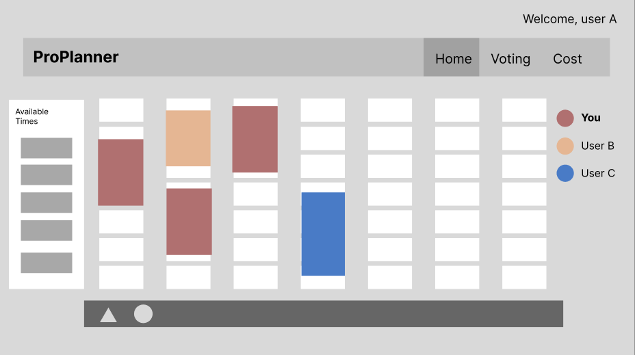

## Project Description
Proplanner is an outing arrangement application that focuses on seamlessly scheduling and planning trips for groups. The application will store and process information on individual availability and preferences, and streamline decision-making. In addition to scheduling and finalizing a time period for a trip plan, we hope to utilize additional features such voting system, cost splitting, and more advanced google map integrations. Our goal is to provide a user-friendly platform for efficient group trip planning.

## Project Requirements

### Minimal Requirements
- ✅ Shareable link that can identify outing 
  - Frontend requests new outing or trip be made
  - Backend server generates outing identification
  - Database collections/documents are updated with base information to support new outing
  - Frontend can make requests through backend to modify + fetch outing information given identifier
- ✅ Users can add availability information - stored individually 
  - Users are provided an intuitive interface to map out busy/available time slots
  - Frontend sends availability profile to backend
  - Backend processes user provided data with database availability information to form available time slots
  - Backend stores available time slots in database
  - Frontend can fetch available time slots
- ✅ Overview page summarizes the availabilities or selected decisions 

### Standard Requirements
- ✅ Users can identify themself and have inputted information tracked to that identity (via username) 
- ✅ Update outing profile with determined trip decisions (ex. Location, date period) 
- ✅ Outing profile schedule can be restricted to certain start and end times (users can only input availability for certain period) 
- ✅ Google maps integration to display location on google maps (open in new tab) 

### Stretch Requirements
- ✅ Cost splitting functionality to aggregate overall cost and delegate costs per person 
- ✅ Voting system to support polls and display results of such polls
- ✅/❌ Timezone support for calendars (partially done)
- ❌ Google Maps static map/places API integration
   - Recommendation options (eg. nearby restaurants, bars, etc.)
   - Static display to get an understanding of surrounding location
- ❌ System displays the time slots that work for everyone to schedule their trip

## Tech Usage
* **HTML, CSS, JS**
    While most of HTML and JS are handled by React in our project, a lot of styling of our components and pages are done through SASS. Our project supports variable screen sizes through media queries and utilization of flexboxes/grid layouts. We decided to deviate from the default theming of our component package (react-bootstrap) which involved much overriding through CSS/SCSS.
    
* **React and Redux**
    React provided an elegant way to develop the frontend, making components reusable and providing efficient state mangement with hooks. We utilized Redux to manage cross-component states and used Redux Thunk to communicate with APIs asynchronously. Additionally, we employed React Router to seamlessly connect all pages without requiring page refreshes.

* **Node & Express**
    Node.js is used in our project as the runtime environment for the backend. The backend uses the Express framework for routing API endpoints and utilizes different routing methods such as GET, POST, PUT, and PATCH. In addition, middleware was used to help with the routing and for retrieving data that was sent along with sending back responses.
* **MongoDB**
    All the data for trips, outings, costs and voting are stored via MongoDB and Mongoose was integrated for formatting the document structure. This project uses a variety of MongoDB functions for updating, fetching and creating new documents.
* **Build and Deployment**
    Hosting of this project is on Render due to limited resources and projected low usage of the application. The project is built through the supplied scripts in create-react-app (eg. Webpack) to bundle the code and dependencies.

## Above and Beyond
Both scheduling components contain a vast amount of complexity owing to usage of managing a possibly large amount of API requests, minmizing computational efforts, and managing proprietary data formats. 

In the event that the calendar is updated, requests are sent to retrieve the necessary information to display, however firing of these requests can outpace their response. As a measure to counter this, requests are cancelled if they aren't settled before navigation off the calendar that requires it.

Due to the large amount of state that the calendar manages, and the frequency in which this state can be updated, processing of data is memoized to prevent needless reprocessing.

For the Outing component specifically, we aimed to minimize the amount of data we were required to store, while still maintaining readability. We chose to only store necessary dates and time ranges that were involved. In order to maintain this format, the outing component takes a user selection, existing selections, and possible selection ranges to rebuild a selection profile that maintains this minimalization of storage space.

## Next Steps
To enhance ProPlanner, we could incorporate a new component on the overview page to offer deeper insights. This may include listing out mutually suitable time slots for scheduling, displaying unanswered polls by the currently logged-in user, or tracking recent modifications made by others concerning various features.

## Contributions
**Ricky Li**
Focused primarily on project design, architecture, and development of the frontend. Guided project structure and created both Outing and Trip calendars components. Assisted other members on development of their responsibilities and managed group organization/meetings.

**Vincent Wu**
Worked mainly on backend development and database structure formatting. Created all the API endpoints (excluding costs) along with making the appropriate routing structure. Created timezone conversion to support user's availabilities in different timezones for trips.

**Radman Avakoli**
I led the project's conceptualization and design of feature prototypes. In terms of code, I developed the cost splitting component of the cost feature and added backend and database support. Additionally, I contributed to Google Map API integration, calendar’s user listing sidebar, and development of an early version of the trip calendar component.

**Heeseop An**
Developed the frontend, which includes the landing page, user selection page, overview page, voting page, and cost splitting page. Designed the database schema for the voting page and cost splitting page. Assisted on the backend for the cost splitting page to support the deletion of multiple users.

**Parham Alijani**
My key contributions encompassed frontend development, particularly in crafting the project's landing page and initiating the Trip Calendar's development. I orchestrated the integration of the Google Maps API, enhancing the user experience through auto-completion and dynamic map rendering based on the planned destination. Additionally, I bridged the backend and frontend functionalities of the user selection page, along with implementing support for user deletion.

 

# Additional Information

## Features
**Terminology**
There are two types of plans, that support the associated type of event:
* Outing: Scheduling for an event that is sensitive to a specific hour (or quarter of hour)
* Trip: Scheduling for an event that is sensitive on the magnitude of days

**Plan Limits**
Outings are capped at a maximum of a range of 5 months and Trips are capped at a year.

### Overview
A simple page to display the overall details of the plan. Provided on this page is a map, an integration with google maps, displaying the location of the plan.

### Scheduling
To define user availabilities, each user can make selections through the edit button just below the calendar.

**Selections** are made through clicking twice, once where the user wants the selection to start and once where it should end. *An initial click in a selected segment will cause it to delete everything within the selection range*. Utilize this to customize to easily cut and modify large segments.

A **Decision** is a range in which the plan is targetted for and can only be a continuous range (limited to the plan restrictions).

A **Summary** of the selections on a particular segment can be found when a segment is clicked while not editing or deciding.

Variable levels of selection can exist and are proportionate to the how many users in the plan select a particular segment.

* Outing Schedule

* Trip Schedule

### Voting
To facilitate improved communication and decision making, a lightweight polling system is in place.

Polls can be made, each poll only permitting one vote per user. The progress bar for each option shows the number of votes and percentage of users that voted for that particular option.

### Cost Splitting
Users are able to easily divide up costs and trackk spendings while on a paricular trip.

The total amount spent on the plan is divided equally amongst all users, accommodating spenders for their contribution to the pool. A progress bar is displayed to show progress along the defined budget of the trip.

## Prototypes
#### Initial prototypes

## API
### **Plan**
#### Description
API for fetching and updating plan parameters
#### Endpoints 
* `GET /plan/:id`
    * Returns the planParameters for a plan
    * **Parameter**
        * `id`: The plan id 
    * **Response**
        * `name`: Name of the planned event
        * `planType`: The type of plan (outing/trip)
        * `dayOffset`: Days of the week availablility
        * `location`: Where the plan is going to be held
        * `dateTimeRange`: The expected date range for the plan
        * `description`: Brief overview for the plan
        * `decision`: The date range choosen for the plan based on user availabilities
        * `budget`: The total funds that can be used for this trip

 

* `PUT /plan/:id`
    * Updates the existing planParameters
    * **Parameter**
        * `id`: The plan id 
    * **Response**
        * `name`, `planType`, `dayOffset`, `location`, `dateTimeRange`, `description`, `decision`, `budget`
### **Outing**
#### Description
API for creating, fetching, and updating outings
#### Endpoints 
* `POST /outing`
    * Creates a new outing document
    * **Response**
        * `id`: id of the newly created document
        * `planParameters`: contains `name`, `planType`, `dayOffset`, `location`, `dateTimeRange`, `description`, `decision`, `budget` 

 

* `PUT /outing/:id`
    * Updates the user availability info
    *   **Parameter**
        * `id`: The plan id 
    * **Response**
        * `_id`: The plan id
        * `month`: Availability user selected for the month

 

* `PUT /outing/decision/:id`
    * Updates the decided date for the plan
    *   **Parameter**
        * `id`: The plan id 
    * **Response**
        * `decision`: The decided date range
        * 
 

* `GET /outing/:id/:userId`
    * Gets the user availability for a specified month
    *   **Parameter**
        * `id`: The plan id 
        * `userId`: The name of the user
    * **Query**
        * `month`: The desired month
    * **Response**
        * `month`

 

### **Trip**
#### Description
API for creating, fetching and updating trips
#### Endpoints 
* `POST /trip`
    * Creates a new outing document
    * **Response**
        * `id`: id of the newly created document
        * `planParameters`: contains `name`, `planType`, `dayOffset`, `location`, `dateTimeRange`, `description`, `decision`, `budget` 

 

* `PUT /trip/:id`
     * Updates the user availability info
    *   **Parameter**
        * `id`: The plan id 
    * **Response**
        * `_id`: The plan id
        * `month`: Availability user selected for the month

 

* `PUT /trip/decision/:id`
    * Updates the decided date for the plan
    *   **Parameter**
        * `id`: The plan id 
    * **Response**
        * `decision`: The decided date range

 

* `GET /trip/:id/:userId`
    * Gets the user availability for a specified month
    *   **Parameter**
        * `id`: The plan id 
        * `userId`: The name of the user
    * **Query**
        * `month`: The desired month
        * `timezone`: User timezone
    * **Response**
        * `month`

### **User**
#### Description
API for fetching, updating, and deleting users
#### Endpoints 
* `PUT /user`
    * Adds a user to a specific plan
    * **Response**
        * An array of the users

 

* `DELETE /user`
    * Removes user(s) from a specific plan
    * **Response**
        * An array of the deleted user(s)

 

* `GET /user`
    * Gets all the users for a specific plan
    *   **Query**
        * `eventId`: The plan id 
    * **Response**
        * An array of current users in the plan

### **Poll**
#### Description
API for fetching and updating polls
#### Endpoints 
* `PUT /poll/:id`
     * Adds a new poll to the existing polls
    *   **Parameters**
        * `id`: The poll document id 
    * **Response**
        * `_id`: The poll id
        * `eventId`: The plan id
        * `polls`: An object containing all the polls

 

* `PUT /poll/:id/:pollId`
    * Removes a single poll
    *   **Parameters**
        * `id`: The poll document id 
        * `pollId`: The id of the poll being removed
    * **Response**
        * `_id`, `eventId`, `polls`

 

* `PUT /poll/option/:id/:pollId`
    * Adds an option to a specific poll 
    *   **Parameters**
        * `id`: The poll document id 
        * `pollId`: The id of the specific poll
    * **Response**
        * `_id`, `eventId`, `polls`

 

* `PATCH /poll/vote/:id/:pollId`
     * Adds the user's vote to the poll 
    *   **Parameters**
        * `id`: The poll document id 
        * `pollId`: The id of the specific poll
    * **Response**
        * `_id`, `eventId`, `polls`

 

* `PATCH /poll/:id`
     * Remove all vote(s) from deleted user(s) 
    *   **Parameters**
        * `id`: The poll document id 
    * **Response**
        * `_id`, `eventId`, `polls`
  
 

* `GET /poll/:eventId`
    * Retrieves the poll information
     *   **Parameters**
            * `id`: The poll document id 
    * **Response**
        * `_id`, `eventId`, `polls`

### **Cost**
#### Description
API for fetching and updating costs
#### Endpoints 
* `GET /cost/:id`
    * Gets all the cost data (spendings) for a specific plan
    *   **Query**
        * `id`: The plan id 
    * **Response**
        * Object with keys '_id' and 'costs' where '_id' is plan id and 'costs' is a nested object of user spendings

 

* `PUT /cost/addExpense/:id/`
    * Adds a user's spending item a specific plan
    *   **Parameter**
        * `id`: The plan id 
    *   **Query**
        * `userName`: Username of the person making a spending item
        * `itemName`: The name of the spending item
        * `itemAmount`: The amount of spending item
    * **Response**
        * Object with keys '_id' and 'costs' where '_id' is plan id and 'costs' is a nested object of user spendings

 

* `PUT /cost/removeExpense/:id/`
    * Removes a user's spending item a specific plan
    *   **Parameter**
        * `id`: The plan id 
    *   **Query**
        * `userName`: Username of the person removing a spending item
        * `expenseId`: The id associated to the stored spending item
    * **Response**
        * Object with keys '_id' and 'costs' where '_id' is plan id and 'costs' is a nested object of user spendings

 

* `PATCH /cost/removeExpense/:id/`
    * Removes a user's spending item a specific plan
    *   **Parameter**
        * `id`: The plan id 
    *   **Query**
        * `usersToDelete`: username to delete
    * **Response**
        * Object with keys '_id' and 'costs' where '_id' is plan id and 'costs' is a nested object of user spendings
### Give our app a try: https://proplanner.onrender.com/
Enjoy!